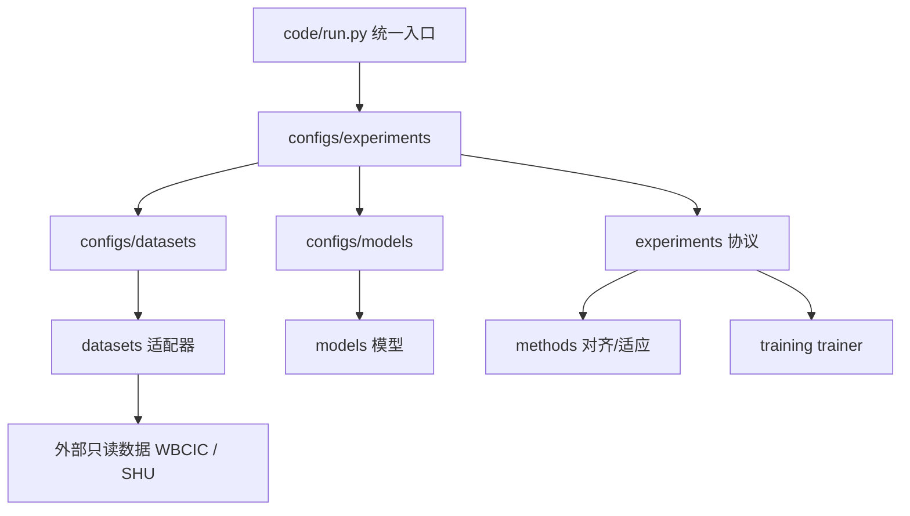

# Architecture

> 项目目录结构 + 代码分层 + 每个文件/目录的作用。新人或新 Agent 看这一份即可理解全局。

## 1. 顶层结构

```text
eeg-mi-online/
├── 0_docs/                 # 文档中心：架构、状态、文件索引、操作日志
├── 1_session_drift/        # Phase 0 漂移诊断结果（报告 + CSV + 图）
├── 2_baseline/             # Phase 1/2a baseline + 2b alignment 结果
├── 3_online_adaptation/    # Phase 3 在线适应（future 设计区）
├── 4_experiments/          # Phase 2c+ 新实验结果入口
├── 5_papers/               # 论文、汇报、图表材料
├── backup/                 # 旧代码/旧文档/历史产物/权重/日志归档
├── code/                   # 代码框架（唯一人工入口 code/run.py）
├── inbox/                  # 临时输入材料
├── AGENTS.md               # 唯一灵魂记忆（先读这个）
├── README.md               # 人类快速入口
├── proposal.md             # 项目提案
├── progress.md             # 进度日记（运行记忆，逐条追加）
├── experiment_log.md       # 实验日志速查
└── results.md              # 结果速查表
```

## 2. 根目录文件

| 文件 | 作用 |
|:---|:---|
| `AGENTS.md` | 唯一权威灵魂记忆：身份、研究链、当前事实、规则、边界。 |
| `README.md` | 项目入口和结构总览。 |
| `proposal.md` | 项目提案与研究动机。 |
| `progress.md` | 进度日记，等价于过去的 PROGRESS.md，逐条追加，最新在上。 |
| `experiment_log.md` | 实验日志速查（精简版）。 |
| `results.md` | 关键结果速查表。 |

## 3. 阶段目录（保存真实结果）

每个阶段实验统一分为 `report/`（文字报告）、`tables/`（数据表）、`figures/`（图）。

| 目录 | 内容 |
|:---|:---|
| `1_session_drift/` | Phase 0 漂移诊断：`report/`、`tables/`、`figures/`。 |
| `2_baseline/no_alignment_baseline/` | Phase 1 baseline + Phase 2a multi-source：`report/`、`tables/`、`figures/`。 |
| `2_baseline/alignment_baseline/` | Phase 2b no-learning alignment：`report/`、`tables/`、`figures/`。 |
| `3_online_adaptation/` | 在线适应设计，当前 future。 |
| `4_experiments/` | Phase 2c+ 新实验，每个实验一个子目录，内部同样用 `report/tables/figures/`。 |
| `5_papers/` | 论文/汇报/图表草稿。 |

注意：阶段目录只放可读结果（报告、汇总表、图）。原始 per-run CSV、split、checkpoint 留在 `backup/root_archive_2026-06-10/` 与外部工作区，不复制进来。新增实验结果也必须遵守 `report/tables/figures/` 三分结构，不要把文件裸放在实验目录根部。

## 4. 代码分层 `code/`



| 目录/文件 | 作用 |
|:---|:---|
| `code/run.py` | 统一入口。`--dry-run` 解析配置；完整训练需直连 `code/experiments` 或临时恢复兼容层。 |
| `code/configs/datasets/` | 数据集路径与元信息：`wbci_shu.yaml`、`shu.yaml`。 |
| `code/configs/models/` | 模型超参：`eegnet/deepconvnet/fbcnet/cap_eegnet.yaml`。 |
| `code/configs/experiments/` | 阶段实验配置：`phase0/phase1/phase2a/phase2b` + future。 |
| `code/datasets/` | `base.py`、`registry.py`、`wbci_shu.py`、`shu.py`、`channel_mapping.py`、`session_splits.py`、`shu_dataset.py`。 |
| `code/models/` | EEGNet / DeepConvNet / FBCNet / CAP-EEGNet + `registry.py`，统一 `{logits, features, confidence}`。 |
| `code/methods/` | `session_alignment.py`（z-score/EA/Riemannian/filterbank）、`bn_adaptation.py`。 |
| `code/experiments/` | `session_drift.py`、`session_protocols.py`、`session_multisource_protocols.py`、`session_alignment_protocols.py`、`metrics.py`、`data_quality.py`。 |
| `code/training/` | `trainer.py`，model-agnostic 训练/预测。 |
| `code/preprocessing/` | 预处理逻辑（WBCIC 已有 npz；SHU 待补 raw→npz）。 |
| `code/utils/` | `config/io/logging/paths/seed`。 |
| `code/visualization/` | 报告/QC 绘图。 |
| `code/online/` | future 在线适应包。 |

## 5. 扩展规则

- 加数据集：`code/datasets/<name>.py` + `code/configs/datasets/<name>.yaml`。
- 加模型：`code/models/<name>.py` + `code/configs/models/<name>.yaml`。
- 加方法：`code/methods/<name>.py`。
- 加实验：`code/experiments/<name>.py` + `code/configs/experiments/<phase>.yaml`。
- 每次新增文件：更新最近的 `README.md` 和 `0_docs/FILE_CATALOG.md`。

## 6. backup 说明

`backup/root_archive_2026-06-10/` 保存清理前的 `src/scripts/configs/docs/outputs/checkpoints/logs/manifests/splits/tests`；`backup/legacy_snapshot_2026-06-10/` 是更早的轻量快照。两者都用于历史追溯，不要删除。
