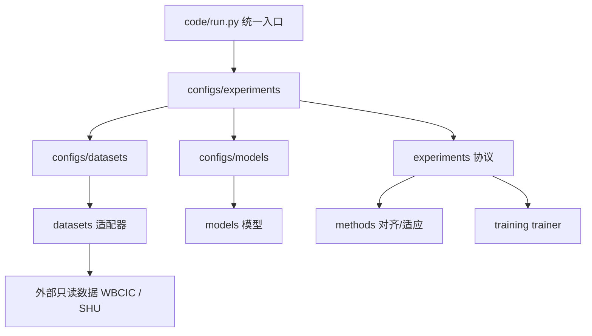

# Architecture

> 项目目录结构 + 代码分层 + 每个文件/目录的作用。新人或新 Agent 看这一份即可理解全局。

## 1. 顶层结构

```text
eeg-mi-online/
├── 0_docs/                 # 文档中心：架构、状态、文件索引、操作日志
├── 1_session_drift/        # Phase 0 漂移诊断结果（报告 + CSV + 图）
├── 2_baseline/             # Phase 1/2a baseline + 2b alignment 结果
├── 3_online_adaptation/    # Phase 3 设计文档区（不放正式实验结果）
├── 4_experiments/          # Phase 2c+ 新实验结果入口（含 tta/）
├── 5_papers/               # 论文、汇报、图表材料
├── backup/                 # 旧代码/旧文档/历史产物/权重/日志归档
├── code/                   # 代码框架（唯一人工入口 code/run.py）
├── tests/                  # 轻量单元/smoke 测试（含 tests/tta/）
├── scripts/slurm/          # Slurm 提交脚本（GPU 训练 / CPU 汇总）
├── inbox/                  # 临时输入材料
├── AGENTS.md               # 唯一灵魂记忆（先读这个）
├── CLAUDE.md               # Claude Code 兼容入口（内容指向 AGENTS.md）
├── PHASE3_ROUTE_PLAN.md    # Phase 3 路线 v2.1（Oracle 先裁决）
├── README.md               # 人类快速入口
├── proposal.md             # 项目提案
├── progress.md             # 进度日记（运行记忆，逐条追加）
├── experiment_log.md       # 实验日志速查
└── results.md              # 结果速查表
```

> `/share/home/yuan/SYX` 下现在只有本项目 `eeg-mi-online/` + `backups/` + 无关的 `run_test.sh`（另一个项目 AADSurvey 的模板）。旧的 `P10_MI泛化研究/`、根目录 `CLAUDE.md`、以及本项目的 `HANDOFF.md` / `CHATGPT_DIRECTOR_BRIEF.md` 已删除——项目已收敛为单一自洽文件夹。

## 2. 根目录文件

| 文件 | 作用 |
|:---|:---|
| `AGENTS.md` | 唯一权威灵魂记忆：身份、研究链、当前事实、规则、边界。 |
| `CLAUDE.md` | Claude Code 兼容入口；内容只是指向 `AGENTS.md`。 |
| `README.md` | 项目入口和结构总览。 |
| `proposal.md` | 项目提案与研究动机。 |
| `progress.md` | 进度日记，等价于过去的 PROGRESS.md，逐条追加，最新在上。 |
| `experiment_log.md` | 实验日志速查（精简版）。 |
| `results.md` | 关键结果速查表。 |

## 3. 阶段目录（保存真实结果）

**数据集并列**：每个结果区先按数据集分 `wbci_shu/` 与 `shu/`，再按实验，最后统一分
`report/`（文字报告）、`tables/`（数据表）、`figures/`（图）。每一层目录都有 README。

| 目录 | 内容 |
|:---|:---|
| `1_session_drift/{wbci_shu,shu}/` | Phase 0 漂移诊断：`report/`、`tables/`、`figures/`。 |
| `2_baseline/{wbci_shu,shu}/no_alignment_baseline/` | Phase 1 baseline + Phase 2a multi-source。 |
| `2_baseline/{wbci_shu,shu}/alignment_baseline/` | Phase 2b no-learning alignment。 |
| `3_online_adaptation/{wbci_shu,shu}/` | 在线适应**设计文档**区；正式 TTA 实验结果不放这里。 |
| `3_online_adaptation/PRETRAINED_MODEL_INTEGRATION_CONTRACT.md` | 预训练模型接入权威契约。 |
| `4_experiments/{wbci_shu,shu}/` | Phase 2c+ 新实验；含 `prototype_drift/` 与 `tta/`（Phase 3）。 |
| `5_papers/{wbci_shu,shu}/` | 论文/汇报/图表草稿。 |

`outputs/` 与 `checkpoints/` 同样数据集并列：`outputs/experiments/{wbci_shu,shu}/<run_id>/`、
`outputs/analysis/{wbci_shu,shu}/<run_id>/`、`checkpoints/{wbci_shu,shu}/<run_id>/`。
checkpoint 命名规范见 `checkpoints/README.md`。

注意：阶段目录只放可读结果（报告、汇总表、图）。原始 per-run CSV、split、checkpoint 留在 `backup/root_archive_2026-06-10/` 与外部工作区，不复制进来。新增实验结果也必须遵守 `report/tables/figures/` 三分结构，不要把文件裸放在实验目录根部。

## 4. 代码分层 `code/`



| 目录/文件 | 作用 |
|:---|:---|
| `code/run.py` | 统一入口。`--dry-run` 解析配置；完整训练需直连 `code/experiments` 或临时恢复兼容层。 |
| `code/configs/datasets/` | 数据集路径与元信息：`wbci_shu.yaml`、`shu.yaml`。 |
| `code/configs/models/` | 模型超参：`eegnet/deepconvnet/fbcnet/cap_eegnet.yaml`。 |
| `code/configs/experiments/` | 阶段实验配置：WBCIC `phase0/1/2a/2b/2c/3` + SHU `shu_phase*` + opt-in `phase3_tta_full_a0`。 |
| `code/datasets/` | `base.py`、`registry.py`、`wbci_shu.py`、`shu.py`、`channel_mapping.py`、`session_splits.py`、`shu_dataset.py`。 |
| `code/models/` | EEGNet / DeepConvNet / FBCNet / CAP-EEGNet + `registry.py`，统一 `{logits, features, confidence}`。 |
| `code/methods/` | `session_alignment.py`、`bn_adaptation.py`；`t3a.py` 为 `code.tta.methods` 薄 re-export。 |
| `code/tta/` | **Phase 3 model-agnostic TTA backend**：adapters（`AdapterCapabilities` + typed errors）/ feature_sources（replay + live inference）/ methods / oracle（`run_label_free` strips target truth）/ eval / report。不绑定 EEGNet；预训练模型通过新 adapter 接入。 |
| `code/experiments/` | `session_drift.py`、`session_protocols.py`、`session_multisource_protocols.py`、`session_alignment_protocols.py`、`prototype_drift.py`、`prototype_drift_summarize.py`、`session_tta.py`(Phase 3)、`metrics.py`、`data_quality.py`。 |
| `scripts/slurm/` | `train_prototype_drift_gpu.sbatch`、`summarize_prototype_drift_cpu.sbatch`、`submit_prototype_drift_full.sh`（GPU 走 gpu2node + mi_torch_cu118）。 |
| `code/training/` | `trainer.py`，model-agnostic 训练/预测。 |
| `code/preprocessing/` | 预处理逻辑：WBCIC `eog_ecg_clean.py/pipeline.py`；SHU `shu_mat.py`（.mat→npz）。入口脚本 `scripts/preprocess_shu.py`、`scripts/scaffold_readmes.py`。 |
| `code/utils/` | `config/io/logging/paths/seed`。 |
| `code/visualization/` | 报告/QC 绘图。 |
| `code/online/` | future 在线适应包（与离线 `code/tta/` 分离）。 |
| `tests/tta/` | Phase 3 行为测试（含 mock checkpoint E2E；fixtures 非生产模型）。 |

## 5. 扩展规则

- 加数据集：`code/datasets/<name>.py` + `code/configs/datasets/<name>.yaml`。
- 加模型：`code/models/<name>.py` + `code/configs/models/<name>.yaml`。
- 加方法：`code/methods/<name>.py`。
- 加实验：`code/experiments/<name>.py` + `code/configs/experiments/<phase>.yaml`。
- 每次新增文件：更新最近的 `README.md` 和 `0_docs/FILE_CATALOG.md`。

## 6. backup 说明

`backup/root_archive_2026-06-10/` 保存清理前的 `src/scripts/configs/docs/outputs/checkpoints/logs/manifests/splits/tests`；`backup/legacy_snapshot_2026-06-10/` 是更早的轻量快照。两者都用于历史追溯，不要删除。
